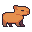
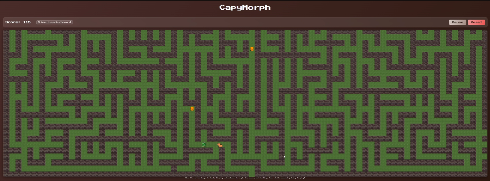
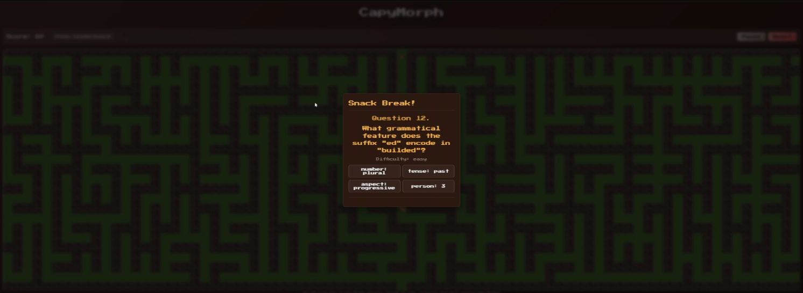
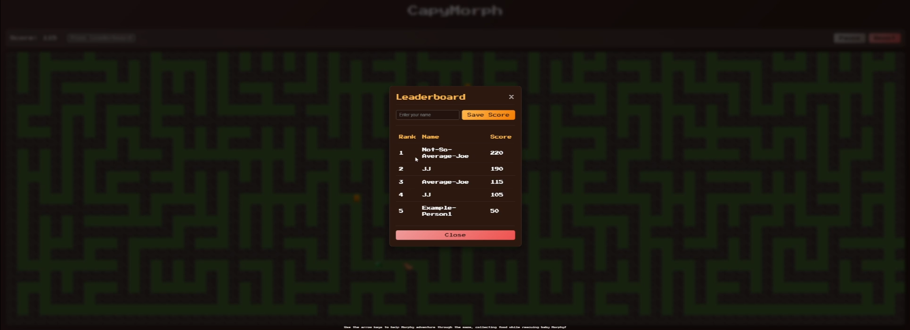

# CapyMorph

**CapyMorph** is an educational game designed to teach language learners about morphemes in a fun and engaging way.

## The Story

Meet **Morphy**, a brave and determined capybara on a mission. Her child, **Baby Morphy**, is lost! To save her, Morphy must navigate through complex mazes, fueled by her favorite snacks: **Cheetos** and **Mountain Dew**.

## Gameplay

- **Navigate the Maze**: Guide Morphy through procedurally generated mazes.
- **Collect Snacks**: Gather Cheetos and Mountain Dew to keep Morphy going.
- **Learn Morphemes**: Answer generated questions about word roots, prefixes, and suffixes to unlock paths and progress.
- **Save Baby Morphy**: Reach the end of the maze to reunite the family!

## Tech Stack

This project is built with a modern web stack, keeping performance and scalability in mind:

- **Frontend**: 
  - **React** & **TypeScript** for the UI and application logic.
  - **Vite** for fast build tooling.
  - **Phaser** for the game engine and rendering the maze scenes.
  - **Zustand** for state management.
- **Backend**: 
  - **Go (Golang)** for the fast backend service.
  - **MongoDB** for storing and retrieving generated questions and game data.

## 🚀 Deployment

## 📸 Demos

Check out some gameplay screenshots below:

### The Maze

*Morphy navigating the maze looking for snacks.*

### Questions

*Answering morpheme questions while navigating the path.*

### Leaderboards

*Compete with other players and climb the ranks to become the morpheme master!*

---
*More updates and demos coming soon!*
